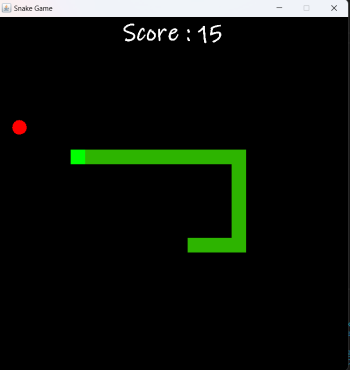

# Snake Game

.png)

## Overview

This is a simple Snake game implemented in Java using Swing components. The game allows players to control a snake, eat apples to score points, and dynamically adjust difficulty as they progress. This README provides information on how to play the game and highlights key features.

## Features

- Classic Snake gameplay with user-friendly controls.
- Randomized apple placement for unpredictability.
- Dynamic difficulty scaling: The game gets faster as you score more points.
- Game over screen displaying the final score.

## Gameplay

- The objective of the game is to control the snake and eat apples to increase your score.
- Avoid colliding with the snake's own body or the game boundaries.
- As you eat more apples, the game speed increases, providing a greater challenge.

## Acknowledgements

- This project was inspired by the classic Snake game.
- Special thanks to the Java Swing library for GUI components.

Happy gaming!
